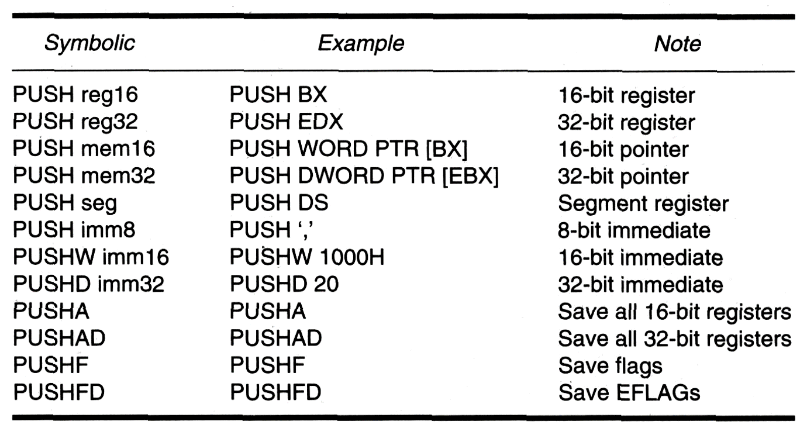
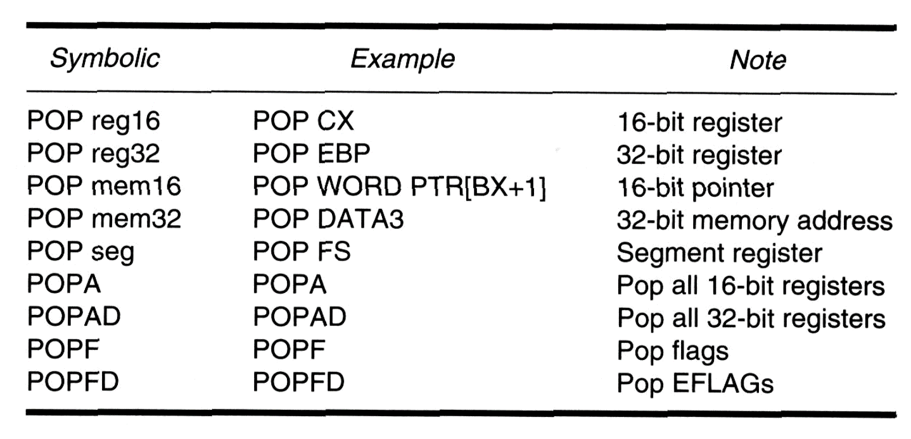
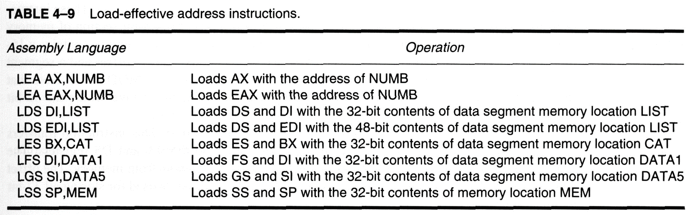

## 移动指令
### MOV 指令 
按照 descriptor 中 D 位的值来确定指令模式
D = 0 表示使用 16-bit 指令模式  
D = 1 表示使用 32-bit 指令模式  
DOS 只能够使用 16-bit 模式  
不存在从内存到内存的转移指令  
对长度不同的寄存器进行赋值的时候要注意指定赋值模式，比如 byte ptr 表示 8 位赋值  
**16-bit mode:**  

Opcode | MOD-REG-R/M | Displacement | Immediate  
--- | ---- | --- | ----  
1-2 bytes |0-1 bytes   |0-1 bytes  |0-2 bytes 

**32-bit mode:**

Address\_size | Operand\_size | Opcode | MOD-REG-R/M | Scaled_index | Displacement | Immediate  
-- | -- | -- | -- | -- | -- | --  
0-1 bytes | 0-1 bytes | 1-2 bytes | 0-1 bytes | 0-1 bytes | 0-4 bytes | 0-4 bytes

formats:  

1. MOV REG, R/M or MOV R/M, REG  
**Eg. MOV CX, MyArray[ECX+EDX\*4]**  
2. MOV R/M, immediate  
**Eg. MOV [BX+32], 1A23H; MOV CL, 3CH**  
3. MOV Seg-REG, R/M or MOV R/M, Seg-REG  //注意段寄存器不加[]符号，因为段寄存器是16位的  
**Eg. MOV DS, AX; MOV [ESI+8], SS**

### PUSH/POP
操作对象:  

 - 寄存器  
 - 内存  
 - 立即数 （POP 不允许弹出给立即数）  
 - 段寄存器 （POP 不允许修改段寄存器）  
 - 标志位  
 - PUSHA/POPA 所有 16 位寄存器  
 - PUSHAD/POPAD 所有 32 位寄存器  

以 POP BX 为例：

	POP BX:
		BX <-- (SP+1,SP);
		SP <-- SP+2;

初始化

	STACK_SEG SEGMENT STACK
	{
		DW 100H DUP(?)
	}	
	STACK_SEG ENDS
	.MODEL SMALL
	.STACK 200H; set stack size

### Load Effective Address
**EA(Effective address)**: is operand's offset addr:

 - displacement 前缀和立即数的运算结果
 - base addr 基地址 一般是寄存器值
 - index addr 索引地址 一般是通用寄存器值
 - scale factor 缩放因子

**EA = base + index \* scale-factor; + displacement**  
format: LEA reg, MEM; MEM 必须是内存地址，将后者的计算地址保存到 reg 中，可以直接使用 DATA1 这样的标识符来获取有效地址  
如果出现溢出的话会去掉最高的符号位  
**该操作往往用于多个数字的复杂计算**

format:
**LXS reg, MEM**  
将 MEM 中的数据低位保存到 reg 中，reg 可以是 32 位寄存器，高位保存到 段寄存器中， X表示所有的段寄存器 包括 DS,ES,FS,GS,SS

### String Data Transfers

 - LODS(SI)
 - STOS(DI)
 - MOVS(SI and DI)
 - INS (DI)
 - OUTS(SI)

#### Direction Flag
	D = 0 DI and SI auto increce 1/2/4
	D = 1 DI and SI auto decrece 1/2/4

#### LODS
	默认使用 DS 段寄存器 SI 地址寄存器，将结果保存在 AL,AX,EAX 中

# 算术运算
余数和被除数同号  
CBW 低位符号拓展  
乘法除法对 flagbits 无定义 只是产生中断

# 逻辑运算
逻辑运算 DST 可以是寄存器或者内存 但是不能是立即数，而SRC 可以是立即数  
逻辑运算 除了 NOT 之外会影响 flagbits  
其中 CF 和 OF 会被清除  
SF ZF PF 会被设置  
AF 未定义  

# 移位操作
不管左移右移 移动出来的数都会放到 C 标志位中  
逻辑操作相当于对无符号数操作  
算术右移相当于对有符号数操作  
旋转操作会循环移位

# 串操作  
SCASB/SCASW/SCASD 后缀表示比较的大小 分别是字/单词/双单词  
不修改 串 的值 并且指令只会运行一次 即只比较一个单位  
一般在前面加上循环指令 REPE 或者 REPNE  
特别要注意最后一位的比较！ 根据 ZF 来判断最后一位  
CMPS 比较 DS 和 ES 两个段里面的字符串 可以用来判断全等

# 跳转指令
保护模式的时候 跳转地址是 32 位

# 汇编
ml(L) ex4-1.asm 汇编并且链接  
debug ex4-1.exe 以调试模式来运行程序  
word 可以用来查看行号

# DEBUG 模式
-u 反汇编 #连续输入的话会进行连续反汇编，不然会址反汇编一部分  
-r 显示当前寄存器值  
-t = 地址 单步跟踪的起始指令 #继续输入 -t 会进行单步执行并每次输出寄存器的值
-g = 地址 [断点] 不设置断点会导致程序不会暂停 断点直接使用地址就可以 最多应该可以设置 **10** 个断点